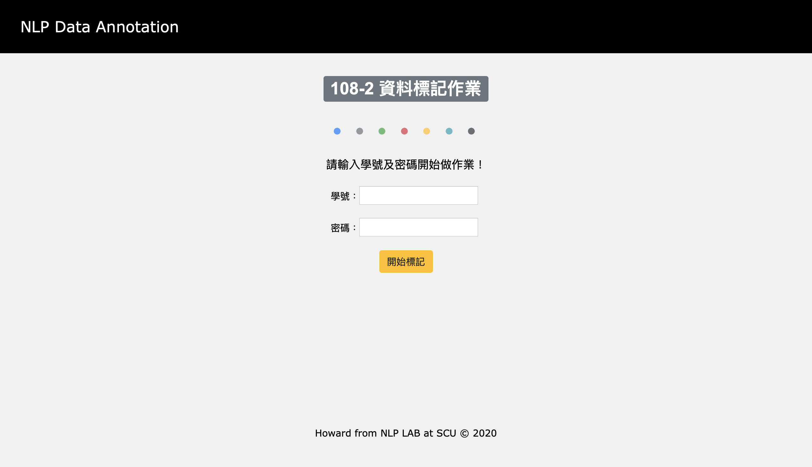
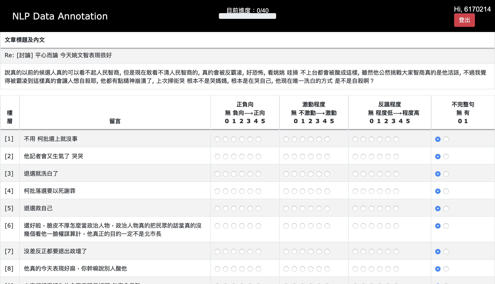

# Data Annotaion System

### Github

https://github.com/h30306/tagged_system

### Author

[Howard W. Chung](https://github.com/h30306)

## Introduction

This library implements Data Annotation System website

Related demo sites
- [Annotation](https://bdtagged.herokuapp.com)

## Require

- python>=3
- xampp
- [MySQL python connecter](https://dev.mysql.com/downloads/connector/python/)
- PHP 7.2.28

## Start Up

1. Launch Xampp App<br>
2. Go to Gerneral page and press start<br>
3. Go to Services page and press start all<br>
4. Go to Network page and press enable<br>
5. Go to Volumns page and press Mount<br>
6. Press Explore button<br>
7. Move this Annotation_system Under /htdocs/ or var/www/html/(For Linux Server)<br>
8. Enter this link in your browser : http://localhost:8080/phpmyadmin/ *Change port to which you start Apach server<br> 
9. Create an empty Database named "VAI"<br>
10. Back to the Annotation_system folder and execute:<br>
```
cd sql_processing
python ./sql_processing.py
```
11. Enter this link in your browser : http://localhost:8080/annotation_system/ *Change port to which you start Apach server
12. All done!

## Deploy on Heroku
>If you want to deploy on heroku, you can follow these steps!

1. Signup in [Heroku](https://dashboard.heroku.com)<br>
2. Install [Heroku CLI](https://devcenter.heroku.com/articles/heroku-cli)<br>
3. Go to the Annotation_system folder<br>
4. execute<br>
```
$ touch composer.json
$ vim composer.json
```
write these in composer.json
{<br>
  "require": {<br>
    "php": "7.2.28"<br>
  }<br>
}<br>
```
$ heroku create Project Name(Annotation_system)
$ git init
$ heroku git:remote -a Project Name(Annotation_system)
```
Then,
Create "Procfile" with no filename extension, and it should look like this:
```
web: heroku-php-apache2
```
And then, uncomment out the first three lines in index.php
```
$ composer update
$ git add .
$ git commit -m 'v0.1'
$ git push heroku master
$ heroku open
```


